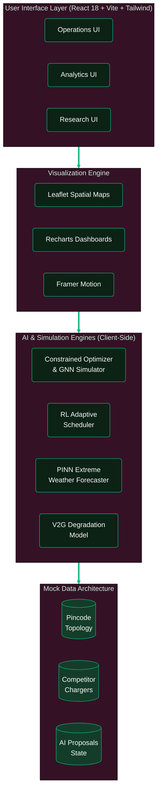
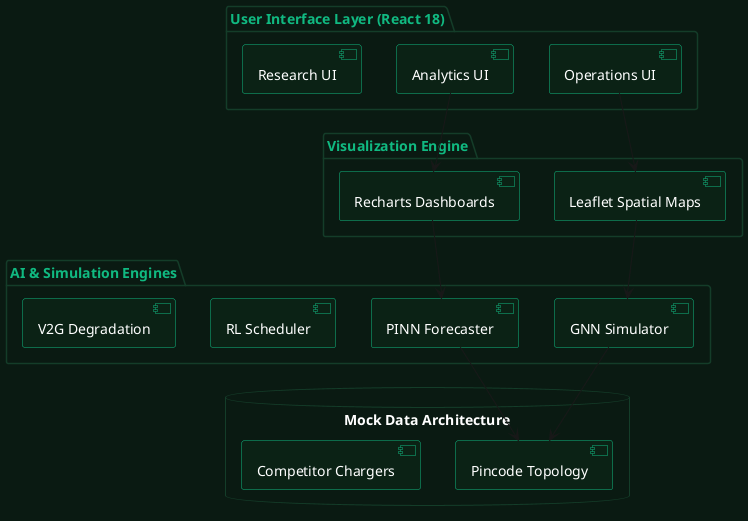
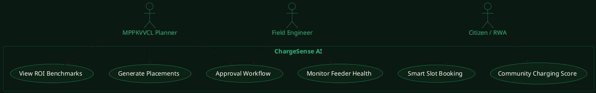

# ChargeSense AI — UML & Architecture Diagrams

These diagrams are styled to match the dark green presentation theme (Hex `#0B2215` / `#10B981`). You can use the Mermaid code in GitHub, Notion, or any Markdown viewer that supports Mermaid. I have also included PlantUML code if you prefer standard UML tools.

---

## 1. System Architecture Diagram (Mermaid)



---

## 2. Use Case Diagram (Mermaid)

```mermaid
%%{init: {
  'theme': 'base',
  'themeVariables': {
    'primaryColor': '#0B2215',
    'primaryTextColor': '#FFFFFF',
    'primaryBorderColor': '#10B981',
    'lineColor': '#10B981',
    'fontFamily': 'sans-serif'
  }
}}%%
flowchart LR
    classDef actor fill:none,stroke:#10B981,stroke-width:2px,color:#10B981;
    classDef usecase fill:#0B2215,stroke:#10B981,stroke-width:1px,color:#FFFFFF,rx:20,ry:20;
    classDef boundary fill:none,stroke:#143D29,stroke-width:2px,stroke-dasharray: 5 5,color:#10B981;

    Planner((MPPKVVCL\nPlanner)):::actor
    Engineer((Field\nEngineer)):::actor
    Citizen((Citizen /\nRWA)):::actor
    AI((AI\nEngine)):::actor

    subgraph System["ChargeSense AI Platform"]
    direction TB
        UC1(Generate Placements\n[GNN/Greedy]):::usecase
        UC2(Forecast Demand\n[PINN]):::usecase
        UC3(Adaptive Scheduling\n[RL Q-Learning]):::usecase
        UC4(Monitor Feeder Health):::usecase
        UC5(Approval Workflow):::usecase
        UC6(View ROI / V2G Benchmarks):::usecase
        UC7(Community Charging Score):::usecase
        UC8(Smart Slot Booking):::usecase
    end
    class System boundary

    Planner --> UC1
    Planner --> UC5
    Planner --> UC6
    
    Engineer --> UC4
    Engineer --> UC5
    Engineer --> UC7
    
    Citizen --> UC7
    Citizen --> UC8

    AI -.-> UC1
    AI -.-> UC2
    AI -.-> UC3
    AI -.-> UC4
```

---

## 3. PlantUML Alternative (For standard UML tools)

If you are using tools like Draw.io or PlantUML Web, you can paste this:

### System Architecture


### Use Case

