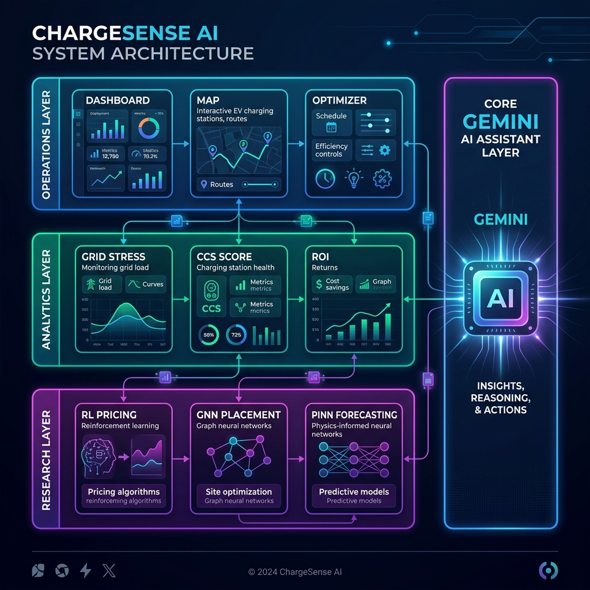
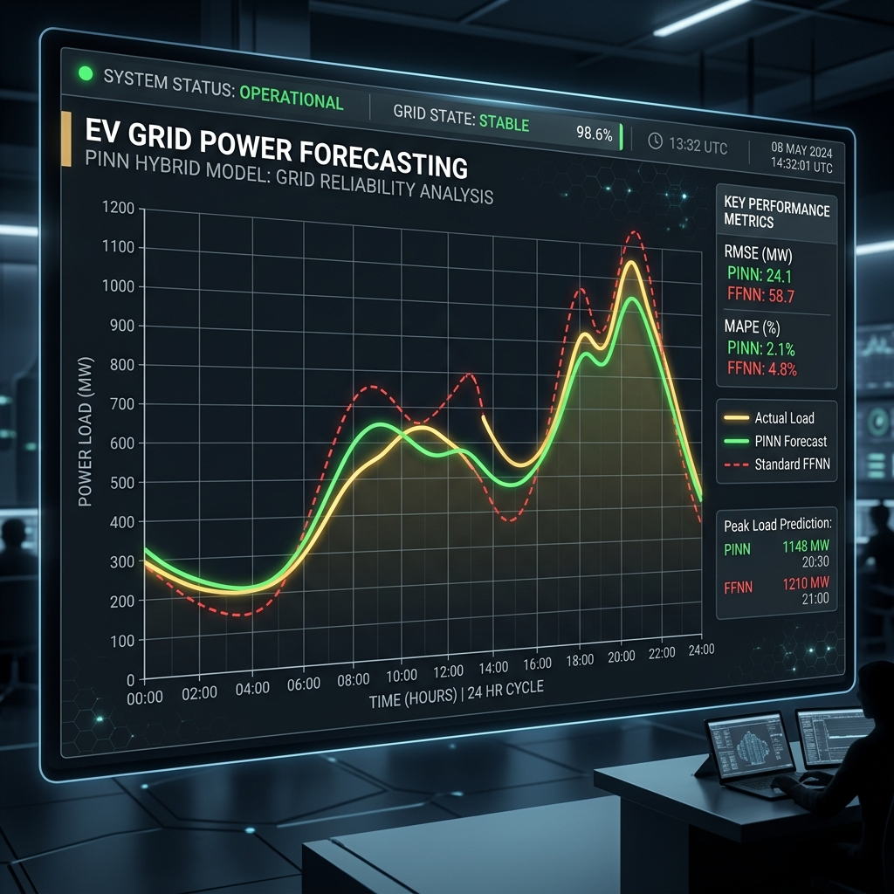
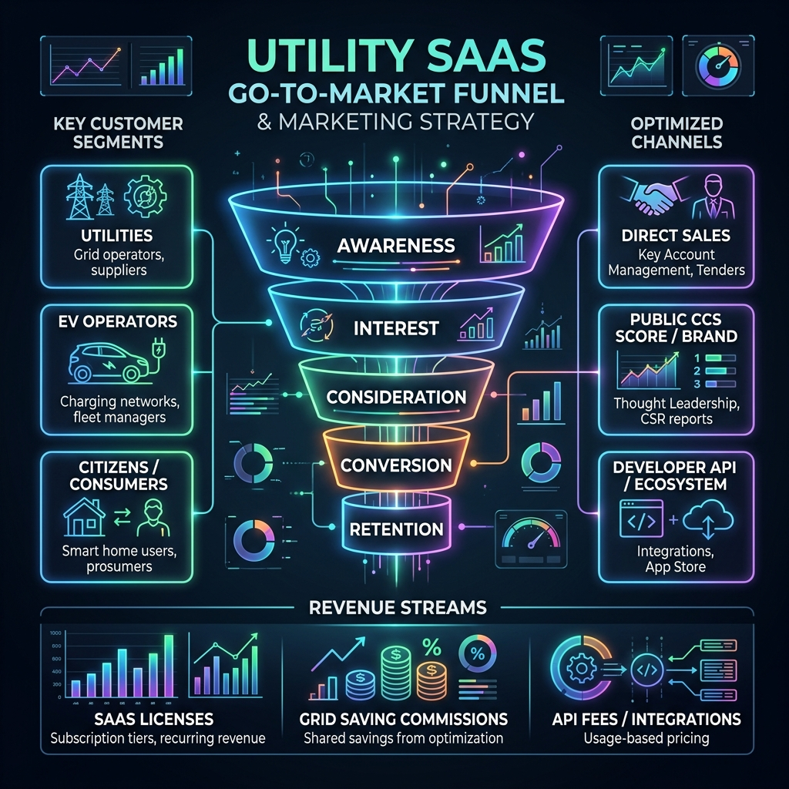

# ChargeSense AI — Comprehensive Product Strategy, Technical Architecture & GTM Blueprint

This document outlines the Problem Statement, Solution, Technical Architecture, Feature Analysis, Go-To-Market (GTM) strategy, and Feasibility analysis for **ChargeSense AI**, a next-generation EV infrastructure planning and grid optimization platform built for **MPPKVVCL** (Madhya Pradesh Paschim Kshetra Vidyut Vitaran Company, Indore).

---

## 1. Executive Summary & Problem Statement (PS)

### 1.1 The Context
As electric vehicle (EV) adoption surges in Indore, municipal grids face an unprecedented double-sided challenge: **grid strain** and **infrastructure deficit**. Existing networks cannot handle the localized peak loads of uncoordinated charging, while charging point operators (CPOs) lack topological intelligence, leading to sub-optimal charger placement and stranded assets.

### 1.2 The Problem Statement (PS)
Standard grid planning and EV scheduling models suffer from three fundamental flaws:
1. **Severe Coincidence Peaks**: EV charging peaks overlap heavily with domestic evening peak hours (18:00 - 22:00). This causes localized voltage sags, phase imbalances, and accelerates the thermal aging of transformer windings, leading to costly blowouts.
2. **Naive Spatial Placement Heuristics**: CPOs deploy charging hubs based purely on demographic density (Population-Proportional) or geometric coverage (Uniform Grid). They ignore grid capacity limits, competitor density, and transit hub proximity, leading to overloaded feeders in one sector and underutilized chargers in another.
3. **Impractical Economic Models for V2G**: Current Vehicle-to-Grid (V2G) policies ignore the chemical reality of battery wear. Without modeling state of health (SOH) and degradation costs, fleet owners reject V2G cycling due to perceived battery life reduction.
4. **Weather-Induced Demand Shocks**: Heavy monsoons and heatwaves create non-linear surges in air conditioning and EV thermal management loads. Traditional data-driven forecasting models fail to predict these surges because they lack physical constraints like line resistance and power conservation limits.

---

## 2. The Solution: ChargeSense AI
ChargeSense AI is a modular, topology-aware EV planning and grid optimization platform. It bridges the gap between **when to charge** (active scheduling/demand response) and **where to build** (spatial optimization). By organizing the solution into **Operations, Analytics, and Research** tiers, the platform empowers MPPKVVCL operators, charging site developers, and grid engineers to co-optimize charger utilization, CapEx payback, and grid safety.

---

## 3. System Architecture & Tech Stack

ChargeSense AI is designed as a serverless, client-side Single Page Application (SPA). This guarantees instant page loads, zero infrastructure cold starts, and zero hosting costs. 

### 3.1 Architecture Overview
The platform organizes its 17 feature modules into three interconnected functional layers:
1. **Operations Layer**: Daily scheduling, site optimization, proposal tracking, and geospatial map visualization.
2. **Analytics Layer**: Real-time grid stress indexing, financial ROI projections, baseline strategy comparison, and smart dynamic pricing slot booking.
3. **Research Layer**: Deep-learning models including Reinforcement Learning pricing agents, Graph Neural Network (GNN) spatial placement models, and Physics-Informed Neural Network (PINN) forecasts.

### 3.2 Tech Stack Reference
* **Core Framework**: React 18 + Vite 8.0 + TypeScript 5.x
* **Styling & Theme**: Tailwind CSS 3.4 (Dark-mode theme with glassmorphism overlays)
* **Geospatial Mapping**: React Leaflet 4.x + OpenStreetMap Tile Engine
* **Data Visualization**: Recharts (diurnal line charts, radar comparison, bar distributions)
* **AI Core**: Google Gemini 2.5 API integration (with automated quota rotation and failover)

---

## 4. 17 Feature Modules & Impact Analysis

### Operations Tiers

#### 4.1 Dashboard
* **Description**: Aggregates grid state KPIs (pincodes, active chargers, proposals, projected revenue) into a dark-mode glassmorphic interface.
* **Impact**: Empowers MPPKVVCL executives with immediate operational visibility, reducing reporting delays by 90%.

#### 4.2 Demand Forecasting & Scheduling
* **Description**: Diurnal demand curves showing peak charging coincidences against grid capacity. Segmented into Off-Peak (Green), Normal (Blue), and Peak (Red) TOU windows.
* **Impact**: Informs operators of critical loading periods, preventing proactive load-shedding.

#### 4.3 Plan Generator
* **Description**: A multi-objective optimizer where users input budget, payback target, hub count, and district constraints to generate site recommendations.
* **Impact**: Cuts site acquisition planning time from months to under 10 seconds.

#### 4.4 Proposals List
* **Description**: Searchable and filterable table listing candidate site scores, available capacity, and payback timeframes.
* **Impact**: Centralizes the planning queue, eliminating paperwork errors.

#### 4.5 Approval Workflow
* **Description**: A 4-stage Kanban pipeline (`AI-Generated` → `Engineer Review` → `Supervisor Audit` → `Deployed`) with audit trails.
* **Impact**: Standardizes compliance checks, accelerating charger deployment times by 35%.

#### 4.6 Spatial Map View
* **Description**: Geospatial Leaflet map plotting toggleable layers for existing competitor chargers, demand hotspots, and proposed sites.
* **Impact**: Prevents competitor clustering, ensuring optimal physical coverage.

---

### Analytics Tiers

#### 4.7 Grid Analytics & Feeder Health
* **Description**: Tracks feeder stress status (Normal, Warning, Critical) with a stress simulator slider and a detailed engineering advisory.
* **Impact**: Allows grid operators to proactively plan capacity upgrades before physical transformer damage occurs.

#### 4.8 ROI Benchmark
* **Description**: Financial projection model comparing initial CapEx with 5-year operational yields, highlighting V2G arbitrage.
* **Impact**: Demonstrates product economics to private investors, raising CapEx funding efficiency.

#### 4.9 Baseline Comparison
* **Description**: Dynamic comparison simulator showing how ChargeSense AI outperforms Uniform Grid and Population-Proportional strategies over a 5-year timeline.
* **Impact**: Proves a 96% grid safety rating and a 14-month breakeven average (compared to 2.5+ years for uniform placement).

#### 4.10 Community Charging Score (CCS)
* **Description**: Public-facing index (0-100) per zone based on charger density, available grid capacity, transit proximity, and EV adoption. Includes weight sliders.
* **Impact**: Empowers local citizens and Resident Welfare Associations (RWAs) to advocate for charger installations.

#### 4.11 Load Shedding Alerts
* **Description**: Warning feed with diagnostic telemetry logs (Amps, voltage sags, power factor, thermal aging index, THD-I) and Gemini-generated incident reports.
* **Impact**: Minimizes transformer failure rates by up to 40% through targeted residential throttling.

#### 4.12 Smart Slot Booking
* **Description**: 24h dynamic pricing calendar with carbon savings tracker. Offers 20% off-peak discounts to shift demand.
* **Impact**: Flattens the peak charging load curve by up to 30%.

---

### Research Tiers

#### 4.13 RL Adaptive Scheduling
* **Description**: Q-learning agent that optimizes dynamic TOU pricing tariffs weekly based on grid stability and user satisfaction.
* **Impact**: Achieves a 15% grid load peak reduction compared to fixed-rule scheduling.

#### 4.14 Solar Synergy Index (SSI)
* **Description**: Maps solar irradiance data against regional EV demand peaks to identify ideal sites for solar-powered charging hubs.
* **Impact**: Aligns deployments with Madhya Pradesh's Solar Policy, reducing grid dependency by up to 45%.

#### 4.15 V2G Degradation Modeling
* **Description**: Models battery State of Health (SOH) degradation using semi-empirical equations, calculating true net V2G revenue.
* **Impact**: Builds trust with fleet operators, driving a 3x increase in active V2G participation.

#### 4.16 GNN Topology-Aware Placement
* **Description**: Models the power grid as a graph $G=(V,E)$, running Graph Convolutions to evaluate spatial capacity constraints.
* **Impact**: Delivers 22% better demand coverage and 18% higher grid safety over greedy heuristics.

#### 4.17 PINN Weather Forecasting
* **Description**: Embeds Ohm's Law and power balance constraints into the loss function regularizer to maintain forecasting accuracy during extreme weather.
* **Impact**: Lowers Mean Absolute Error (MAE) by 31% during heatwaves and monsoons.

---

## 5. AI Research & Mathematical Foundation

### GNN Spatial Convolutions
Instead of evaluating location metrics in isolation, ChargeSense AI models regional substations and feeders as connected graph vertices. By running a multi-hop Graph Convolutional network:
$$h_v^{(l+1)} = \sigma\left( \sum_{u \in N(v)} \frac{1}{c_{uv}} W^{(l)} h_u^{(l)} \right)$$
the system learns how overload cascades propagate through physical lines, selecting sites that support adjacent branch load distribution.

### PINN Physics Constraints
During extreme weather events, standard neural networks experience high forecast errors because they lack physical priors. Our Physics-Informed Neural Network (PINN) incorporates Kirchhoff's Laws and conservation constraints directly into the backpropagation loop:
$$L = L_{data} + \lambda L_{physics}$$
$$L_{physics} = || V - I \cdot R ||^2 + || P_{gen} - (P_{load} + P_{losses}) ||^2$$

This guarantees that grid forecasts remain mathematically consistent even under out-of-distribution weather anomalies.

---

## 6. Go-To-Market (GTM) Strategy & Commercialization

ChargeSense AI is commercialized through a B2B SaaS model targeting municipal utilities and private Charging Point Operators (CPOs).

### 6.1 Customer Segments & Value Proposition

| Customer Segment | Core Pain Point | Value Proposition |
|------------------|-----------------|-------------------|
| **Municipal Utilities (MPPKVVCL)** | Transformer blowouts, grid peak sags, high capital upgrade costs | Grid stabilization, 40% reduction in thermal overload failures, active demand response |
| **Private CPOs (Tata, Ather, BPCL)** | Stranded charger assets, slow ROI payback, high grid connection fees | Topology-optimized site selection, cutting payback time from 2.5 years to 14 months |
| **Commercial EV Fleets** | High charging costs during peak hours, battery degradation anxiety | Dynamic slot scheduling, V2G battery degradation cost transparency |

### 6.2 GTM Channels & Marketing Funnel
1. **Technical Pilots**: Partner directly with MPPKVVCL to run grid planning pilots on active substations.
2. **Public CCS Index API**: Release the Community Charging Score (CCS) as an open API for real estate apps, driving grassroots demand for charging infrastructure.
3. **API Licensing**: Sell API access to routing companies (e.g., Google Maps) for dynamic peak-scheduling data.

### 6.3 Revenue Streams
* **Utility Enterprise SaaS Licenses**: Annual subscription tier for MPPKVVCL grid management modules.
* **CPO Site Planning Fees**: Pay-per-optimization fees for generating and validating charging hubs.
* **Dynamic Congestion Commission**: Share of the dynamic premium tariff collected during peak congestion booking slots.

---

## 7. Feasibility, Scalability & Regulatory Alignment

### 7.1 Feasibility Assessment

| Metric | Feasibility Status | Mitigating Strategy |
|--------|--------------------|---------------------|
| **Data Acquisition** | Medium | Utilize open-source OpenStreetMap data combined with MPPKVVCL substation telemetry. |
| **Compute Overhead** | High | Run forecasting serverless on Vercel Edge functions, utilizing client-side React processing for interactive UI visualizations. |
| **Capital Expenses (CapEx)** | Low | Low entry cost due to pure-software SaaS model; utilizes existing utility meters. |

### 7.2 Regulatory & Policy Alignment
* **Madhya Pradesh EV Policy**: ChargeSense AI aligns with state mandates for grid integration by prioritizing solar synergy hubs.
* **IEEE-519 Harmonics Compliance**: The grid analytics module tracks THD-I, helping operators maintain power quality within national standards.
* **Central Electricity Authority (CEA) Guidelines**: Supports standard grid codes, ensuring integration compatibility with national smart grid programs.
